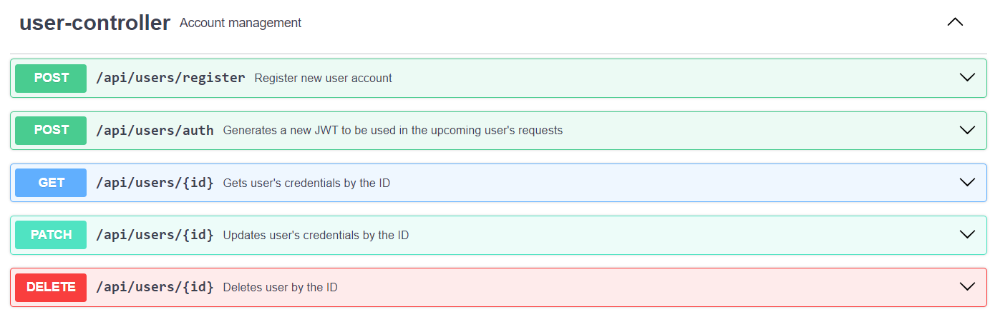
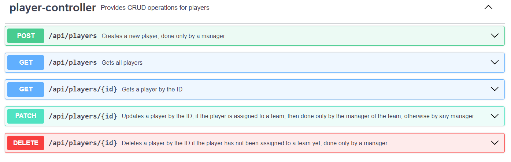
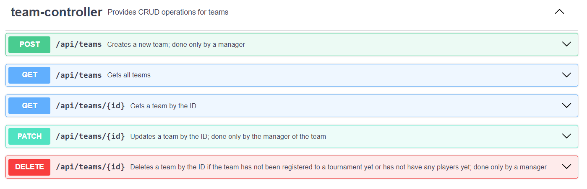
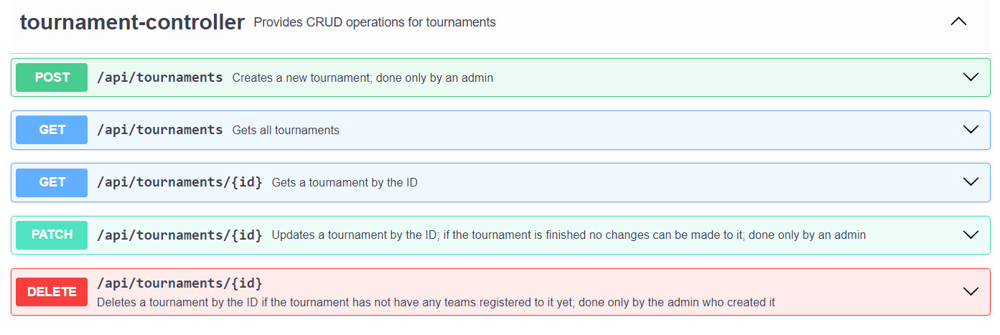
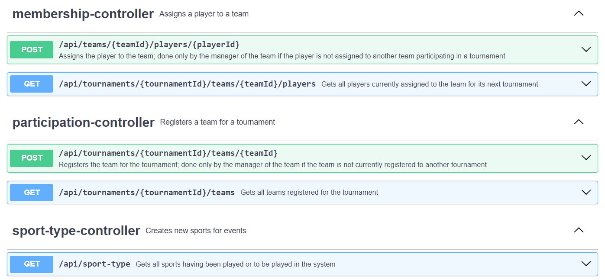
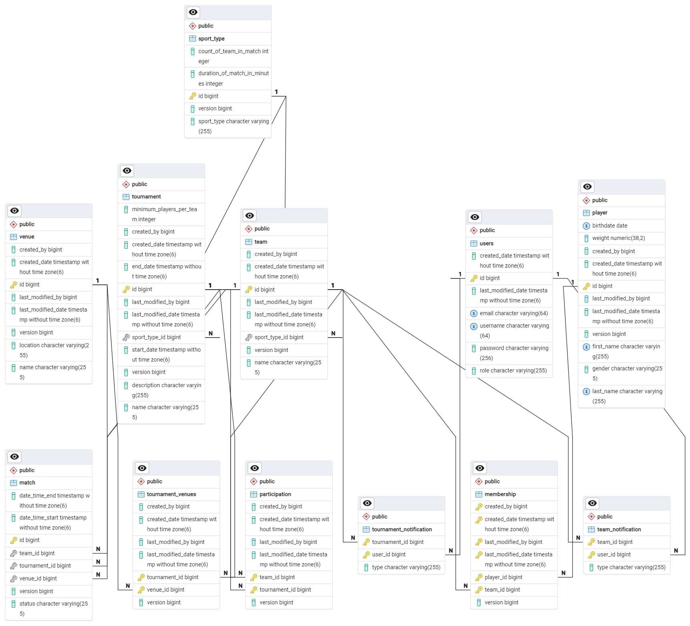

# Sports Tournament Organizer

---
## General information
The idea of the project is to provide a web-based system for creating and managing sport events of any type.
It makes the process of managing such events, where many tournaments, teams and players
with many frequently changing relationships between them, convenient and pleasant.

---
## Features and specification
* User registration, authentication and authorization
    * The system supports 3 user categories: manager, regular users and admins
      where each category has a specific set of functionalities.

* Tournament creation and management
    * A tournament gets created only by admins.
    * It can be updated by any admin as long as the tournament has not started yet.
    * It can be deleted only by the admin who created it as long as the tournament does not have any teams.
    * Team registration to a tournament - It can be done only by the manager of the team
      if the tournament has not started yet and the team is not registered to another tournament
      and the team has enough players to play in it and the sport type of the team and the tournament match

* Player and team management
    * A player gets created only by users with manager role.
    * It can be updated by any manager if the player is not assigned to a team,
      otherwise only the manager of the team in which the player is assigned, can update it.
    * It can be deleted only by a manager if the player has never been assigned to a team.
    * A team gets created only by users with manager role.
    * It can be updated only by the owning manager.
    * It can be deleted only by the owning manager if the team never participated in any tournaments and never any players
    * Player registration to a team - It can be done only by the manager of the team
      if the player is not registered to another team at the moment and the team is not already registered to a tournament

* Additional functionalities
    * JWT
        * Use case - feature providing an authentication mechanism which improves system scalability
        * Implementation - makes use of several beans used in a separate config package
    * Optimistic locking
        * Use case - future-proof feature which can become very important
          when traffic to the system gets huge. In such case it will become a frequent practise to have many users
          try to change the same resource which may result in an inconsistent resource state.
        * Implementation - makes use of @Version annotation applied to a version field of type Long
          which is an attribute to the entity where such problem can arise. It identifies the current state of the resource.

---
## REST endpoints

---
## Database schema

---
## Used technologies
* Java 21
* Spring Boot
* Hibernate
* PostgreSQL
* Postman
* JUnit 5
* Mockito
* Git
* Docker
* Angular

---
## Setup
### Prerequisites (for the backend)
* [Docker](https://docs.docker.com/get-docker/)

### Steps
1. Clone the repository -> https://github.com/Georgi-Topov/SportsTournamentOrganizer.git
3. Compile Spring boot application into jar file via Maven
4. Write into terminal `docker -t yourNameOfImage`
5. Use that image in docker-compose.yml
2. Write into terminal docker-compose up
4. In frontend directory write into terminal npm install
5. After that write npm start

### Testing
The REST API can be tested by using:
* Postman
