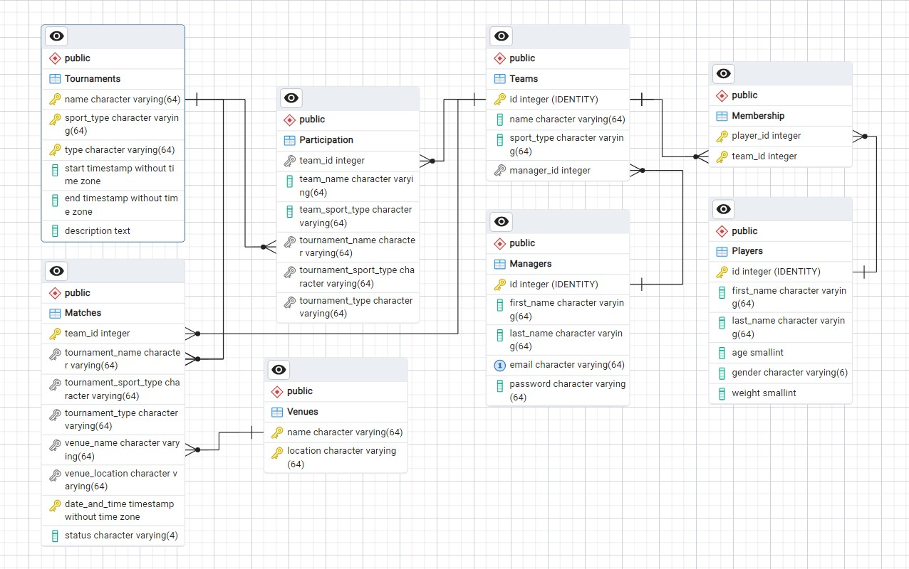

# Sports Tournament Organizer

## Database model

The **Players** table consists of:
* **id** - A unique ID for each player
* **first_name** - Player's first name
* **last_name** - Player's last name
* **gender** - Player's gender. It can be useful for some sports.
* **weight** - Player's weight. It can be used in some sports where players are divided into categories based on it.

---

Managers are users to register team's players. For that they have to be registered and logged in the system.  
The **Managers** table consists of:
* **id** - A unique ID for each manager
* **first_name** - Manager's first name
* **last_name** - Manager's last name
* **email** - Manager's email. Email is set to be unique. It can be used to send updates to the team's manager.
* **password** - Manager's password

---

The **Teams** table consists of:
* **id** - A unique ID for each team
* **name** - Team's name
* **sport_type** - The type of the sport that the team will participate in
* **manager_id** - It references the Managers table

---

The **Membership** table is used as an additional table to create a many-to-many relationship between the **Players** table and the **Teams** table. It consists of:
* **player_id** - It references the Players table
* **team_id** - It references the Teams table

---

The **Tournaments** table uses a combination of the attributes **name**, **sport_type** and **tournament_type** as a primary key. It consists of:
* **name** - The name of the tournament
* **sport-type** - The type of sport (e.g. football, tennis, running, wrestling)
* **tournament-type** - The type of the tournament (e.g. International, Local, Charity)
* **start** - The start of the tournament
* **end** - The end of the tournament
* **description** - Description of the tournament based on the name the type of sport and type of the tournament itself

---

The **Participation** table is used as an additional table to create a many-to-many relationship between the **Tournaments** table and the **Teams** table. It consists of:
* **team_id** - It references the Teams table
* **team_name** - It references the Teams table. With a query can be used with team_sport_type to ensure the third implementation detail written below.
* **team_sport_type** - It references the Teams table
* **tournament_name** - It references the Tournaments table
* **tournament_sport_type** - It references the Tournaments table
* **tournament_type** - It references the Tournaments table

---

In general the **Matches** table makes use of several tuples to represent a single match because the number of opponents can vary depending on the sport type. The table consists of:
* **team_id** - It references the Teams table
* **tournament_name** - It references the Tournaments table
* **tournament_sport_type** - It references the Tournaments table
* **tournament_type** - It references the Tournaments table
* **venue_name** - It references the name of the place where the match will be played
* **venue_location** - It references the location of the place since for different locations (e.g. countries) name of the places can be the same
* **date_and_time** - The date and time of the match
* **status** - Team's status for the given match (e.g. win, loss)

---

The **Venues** represent a collection of exact locations that can be used for many matches in different tournaments. It consists of:
* **name** - The name of the place where a match will be played
* **location** - The location of the place

---

### Important implementation details:
1. During an active tournament a manager of a participating team cannot manage other teams
2. A team can not participate in 2 (or more) tournaments of the same type if both tournaments are active
3. A player can not be a member of 2 (or more) teams that are registered to the same active tournament

### Database schema:
